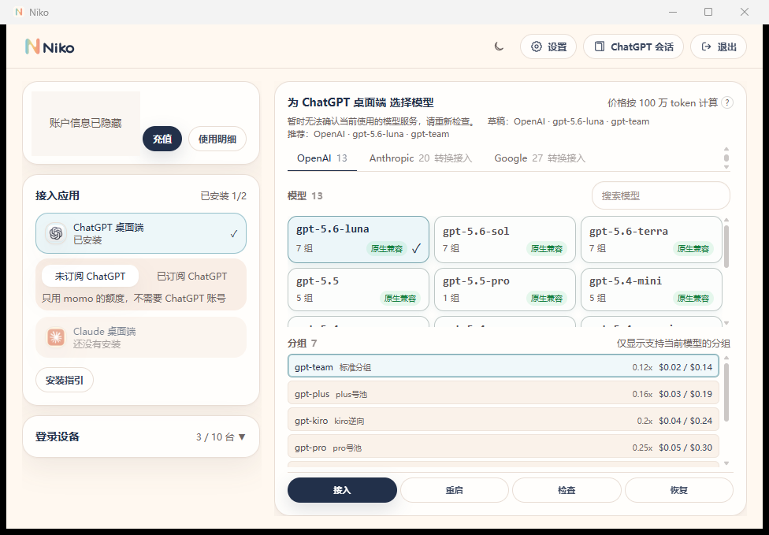
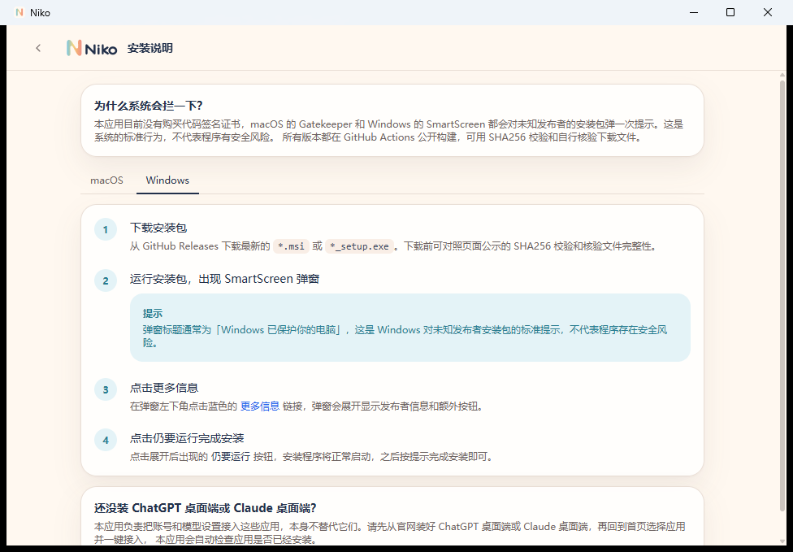

<p align="center">
  
</p>

<h1 align="center">Niko</h1>

<p align="center">
  <strong>一键接入 AI 助手的桌面工具</strong>
</p>

<p align="center">
  登录账号，选择应用和模型，剩下的配置交给 Niko。
</p>

<p align="center">
  <a href="https://github.com/meyaomiao/niko/releases/latest">
    
  </a>
  <a href="https://github.com/meyaomiao/niko">
    
  </a>
  <a href="https://github.com/meyaomiao/niko/issues">
    
  </a>
</p>

<p align="center">
  
  
  
  
</p>

## 产品截图

### 完整首页：选择、接入与验证

<p align="center">
  
</p>

<p align="center">
  <sub>完整首页截图。账户标识、余额与更新时间已隐藏。</sub>
</p>

| 界面区域 | 功能 |
| --- | --- |
| 顶部导航 | 切换主题，进入设置或 ChatGPT 会话管理，并可退出当前账号。 |
| 左上账户卡片 | 查看余额更新时间，进入充值和使用明细；截图中的个人数据已隐藏。 |
| 左侧“接入应用” | 查看 ChatGPT、Claude 的安装与接入状态，选择目标应用，并在缺少应用时打开安装指引。 |
| 右侧模型区 | 按 OpenAI、Anthropic、Google 浏览和搜索模型，查看每个模型支持的分组与兼容等级。 |
| 右侧分组区 | 只显示支持当前模型的分组，并展示倍率和输入/输出参考价格。 |
| 底部操作区 | “接入”写入配置，“重启”重新打开目标应用，“检查”验证连通性，“恢复”还原官方默认配置。 |
| 登录设备 | 查看当前账号的登录设备，并撤销不再使用的设备会话。 |

### 安装与首次使用

<p align="center">
  
</p>

<p align="center">
  <sub>针对 macOS 与 Windows 提供分步安装指引，解释系统安全提示，并给出安装包校验方式。</sub>
</p>

安装指引根据系统分别说明安装包格式、GitHub Releases 下载入口、SHA256 校验方法，以及 macOS Gatekeeper 或 Windows SmartScreen 提示的处理方式。页面也会引导用户先安装 ChatGPT 或 Claude 桌面端，再回到首页完成自动检测和接入。

## 关于 Niko

Niko 是一个桌面端 AI 接入工具。登录账号后，选择应用、分组和模型，Niko 会自动把需要的配置写入 ChatGPT 桌面端或 Claude 桌面端。

用户不需要自己找配置文件，也不用手动复制 API 地址和密钥。Niko 不提供聊天界面，也不替代官方应用，实际使用仍在 ChatGPT 或 Claude 中完成。

服务端由 [momotoken](https://momotoken.win) 提供，本仓库只维护 Niko 客户端。

## 安装

前往 [Releases](https://github.com/meyaomiao/niko/releases/latest) 下载最新版本。

| 平台 | 系统要求 | 安装包 | 说明 |
| --- | --- | --- | --- |
| macOS | macOS 12 或更高版本 | `.dmg` | 支持 Apple Silicon 和 Intel，发布包已签名并公证 |
| Windows | Windows 10 或更高版本 | `.msi` / `*_setup.exe` | 当前发布包暂未做代码签名 |

Windows 首次安装时可能出现 SmartScreen 提示。点击“更多信息”，再点击“仍要运行”即可继续安装。

## 快速开始

1. 安装并打开 Niko。
2. 登录 momotoken 账号。
3. 选择要接入的应用、分组和模型。
4. 点击“启用”，等待 Niko 写入配置。
5. 按提示重启 ChatGPT 或 Claude。
6. 使用“连通性测试”确认配置已经生效。

需要退出接入时，可以直接恢复官方默认配置。

## 主要功能

核心流程：`登录 → 检测应用 → 选择模型服务与模型 → 接入 → 重启并检查 → 随时恢复`。

| 能力 | 功能说明 |
| --- | --- |
| 账号与设备 | 登录 momotoken 账号，支持两步验证、记住登录和多设备会话管理。 |
| 应用检测 | 自动识别本机的 ChatGPT 桌面端与 Claude 桌面端；未安装时提供对应平台的安装指引。 |
| 模型选择 | 按厂商浏览可用模型，查看分组、倍率、价格与兼容等级，并记住上次选择。 |
| 一键接入 | 把选中的分组和模型写入一个或全部已安装应用，无需手动查找配置文件或填写密钥。 |
| 生效检查 | 启动或重启目标应用，并通过连通性检查确认当前配置能够正常请求模型。 |
| 安全恢复 | 写入前保存配置快照，写入失败时回滚，也可手动恢复快照或官方默认配置。 |
| ChatGPT 会话 | 检查和同步 ChatGPT 桌面端本地会话，在切换 Niko 与官方模型服务后继续已有会话。 |
| 用量与日常设置 | 查看余额和用量明细，完成充值、主题切换、开机启动、托盘、脱敏日志导出与应用更新。 |

## 与类似产品的体验差异

下面按常见产品形态比较使用体验，不针对某一个具体项目；实际能力可能随各产品版本变化。

| 对比维度 | Niko | 常见方案 |
| --- | --- | --- |
| 使用入口 | 接入完成后继续使用 ChatGPT 或 Claude 官方应用，不增加新的聊天界面。 | 聚合聊天客户端通常要求迁移到自己的界面和会话体系。 |
| 首次配置 | 登录后选择应用、模型服务和模型即可，不需要查看或复制 API Key。 | 手动配置或通用切换器通常需要填写服务地址、密钥和配置字段。 |
| 本地运行 | 不在本地运行代理服务；接入完成后可以关闭 Niko。 | 本地网关类工具通常需要常驻进程，并处理端口、代理和启动顺序。 |
| 切换反馈 | 同一流程内完成应用检测、模型兼容提示、配置写入、应用重启和连通性检查。 | 单纯配置编辑工具通常只负责写文件，是否生效需要用户自行判断。 |
| 恢复能力 | 每次写入前保存快照，失败自动回滚，并提供恢复快照和官方默认配置。 | 手动修改时往往需要用户自己备份、排错和还原配置。 |
| 账号信息 | 在桌面端统一查看余额、价格、用量和登录设备。 | 通用客户端或配置切换器通常不包含特定服务的账号与计费信息。 |

Niko 的取舍也很明确：它只面向 momotoken 和已支持的官方客户端，不是通用供应商管理器，也不提供聊天、MCP 编排或本地代理。当前会话检查与同步仅支持 ChatGPT 桌面端，Claude 普通聊天仍使用原有的 Anthropic 账号。

## 当前接入范围

### ChatGPT 桌面端

Niko 可以配置 ChatGPT 桌面端中 Codex 使用的模型和接口。如果用户有 ChatGPT 付费订阅，也可以保留原有登录状态，只让模型请求使用 momotoken。

### Claude 桌面端

Niko 可以配置 Claude 桌面端内置的 Claude Code 功能。Claude 普通聊天仍使用用户原有的 Anthropic 账号。

### DSH

Niko 可以把 momotoken 写成 DSH 的自定义网关，并打开 Web 工作台。配置写入后下一个请求生效，不必重启 DSH 进程。

### ZCode

Niko 会在 ZCode 里新增自定义提供方 `Niko / momotoken`，不改智谱登录。打开应用后需要在 ZCode 里选中该提供方。

## 设计理念

- **简单**：把登录、选模型和写配置放在一个流程里。
- **轻量**：不在本地运行代理服务，协议转换由服务端处理。
- **少改配置**：只修改接入需要的字段，尽量保留用户原有设置。
- **可以恢复**：写入前保存配置快照，失败时回滚，也可以恢复官方默认配置。
- **减少密钥操作**：用户不需要查看或复制 API Key；“记住我”的登录信息保存在系统钥匙串中，导出的日志会隐藏敏感内容。

## 路线图

- [x] ChatGPT 桌面端接入
- [x] Claude 桌面端接入
- [x] 分组与模型选择
- [x] 用量、充值和设备管理
- [x] 配置快照、连通性测试和恢复官方默认
- [x] macOS 与 Windows 安装包
- [x] DSH 与 ZCode 桌面接入
- [ ] 支持更多官方 AI 客户端和命令行工具
- [ ] 完善不同客户端版本的兼容检测
- [ ] 改进诊断、故障提示和配置恢复
- [ ] 完善 Windows 代码签名和安装体验

## 本地开发

需要提前安装：

- Node.js 20+
- Rust stable
- 当前平台对应的 [Tauri 2 开发依赖](https://v2.tauri.app/start/prerequisites/)

```bash
git clone https://github.com/meyaomiao/niko.git
cd niko
npm install
npm run tauri dev
```

构建安装包：

```bash
npm run tauri build
```

正式发布时，macOS 必须在发布者本机完成 universal 构建、Developer ID 签名、Apple 公证和装订；GitHub Actions 只生成 Windows 安装包。完整步骤见 [发布流程](docs/release-process.md)。

主要技术栈：Tauri 2、React 19、TypeScript、Tailwind CSS 和 Rust。

## 问题反馈

遇到安装、登录、模型接入或配置恢复问题，可以在 [Issues](https://github.com/meyaomiao/niko/issues) 中提交。请说明操作系统、Niko 版本、目标应用和问题现象，不要上传密码或完整 API Key。

如果 Niko 对你有帮助，可以点击仓库右上角的 **Star** 收藏项目。

## 关联项目

- [momotoken-new-api](https://github.com/meyaomiao/momotoken-new-api)：账号、模型、计费和协议转换服务。
