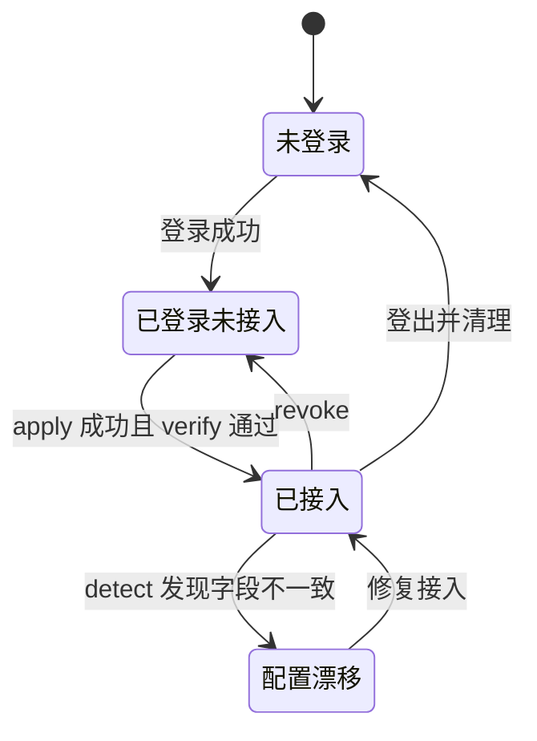
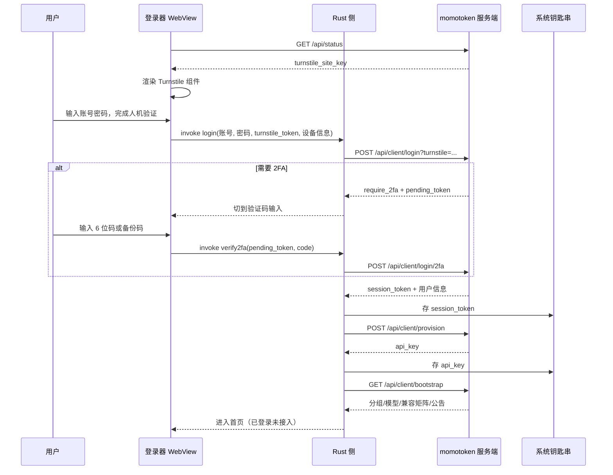

# momo 登录器完整设计方案（详细设计）

- 状态：详设 v1，字段级、可直接开发
- 上游文档：`docs/momo-launcher-product-plan.md`（产品方案，讲 what/why）。本文只讲 how
- 归属仓库：客户端待定仓库名，服务端改动在 `meyaomiao/momotoken-new-api`
- 关联流程：`.github/ISSUE_WORKFLOW.md`
- 读法：第 2 节是全部结论的事实来源，每条都带 `文件:行号`，实现时以源码为准；第 6、7 节是核心交付物，可直接照着写代码

## 1. 本次详设新发现的两条硬约束

这两条会改变原产品方案里的做法，必须先看。

### 1.1 Turnstile token 走 URL query，不是请求体

`middleware.TurnstileCheck` 读的是 `c.Query("turnstile")`（`middleware/turnstile-check.go:26`），并且如果 session 里已有 `turnstile` 标记就直接放行（`:20-25`）。

所以客户端登录请求必须构造成：

```
POST /api/user/login?turnstile=<cf-turnstile-response>
Content-Type: application/json

{"username": "...", "password": "..."}
```

把 token 放进 body 会被判空并拒绝。

### 1.2 `access_token` 是用户表上的单槽字段，登录器不能直接复用

`GET /api/user/self/token` 对应 `GenerateAccessToken`（`controller/user.go:377`），它每次调用都重新生成随机 key 并覆盖 `user.access_token`；`ValidateAccessToken` 是拿 `access_token` 列做等值查询（`model/user.go:948`）。

含义：全站每个用户只有一个 access token。登录器登录一次，用户网页端的令牌立刻失效；用户在网页点一次「生成令牌」，登录器立刻掉线。多设备更是互相踢。

结论：登录器**不复用** `access_token`，服务端必须新增独立的设备会话表与 `/api/client/*` 接口（第 6.2 节）。这是服务端唯一不可省的改动。

## 2. 事实基线

### 2.1 momotoken 服务端现有可用接口

鉴权：`Authorization: Bearer <token>`，中间件会剥掉 `Bearer ` 前缀，也接受裸 token（`middleware/auth.go:46`、`model/user.go:952`）。

| 方法与路径 | 处理函数 | 登录器用途 |
| --- | --- | --- |
| `POST /api/user/login?turnstile=` | `controller/user.go:40` | 账号密码登录 |
| `POST /api/user/login/2fa` | `router/api-router.go:75` | 2FA 第二步 |
| `GET /api/user/self` | `controller/user.go:465` | 用户信息与额度 |
| `GET /api/user/self/groups` | `router/api-router.go:87` | 可用分组 |
| `GET /api/user/models` | `router/api-router.go:89` | 可用模型（注意路径不是 `/self/models`） |
| `POST /api/token` | `controller/token.go:167` | 创建本机专属 Key |
| `GET /api/token/:id/key` | `controller/token.go:80` | 取回完整 Key，返回 `{"key": "sk-..."}`（`:92`） |
| `GET /api/pricing` | `controller/pricing.go:36` | 模型价格、分组倍率、可用分组、端点类型 |
| `GET /api/log/self`、`GET /api/data/self` | — | 用量明细与曲线 |
| `GET /api/status` | `controller/misc.go` | 站点配置，含 `turnstile_site_key`（`:75`） |

`GET /api/pricing` 响应结构（`controller/pricing.go:67-76`）：

```json
{
  "success": true,
  "data": [ /* []model.Pricing */ ],
  "vendors": [],
  "group_ratio": { "default": 1.0 },
  "usable_group": { "default": "默认分组" },
  "supported_endpoint": {},
  "auto_groups": [],
  "pricing_version": "a42d372ccf0b5dd13ecf71203521f9d2"
}
```

`model.Pricing` 字段（`model/pricing.go:18-39`）：`model_name`、`description`、`icon`、`tags`、`vendor_id`、`quota_type`、`model_ratio`、`model_price`、`owner_by`、`completion_ratio`、`cache_ratio`、`create_cache_ratio`、`image_ratio`、`audio_ratio`、`audio_completion_ratio`、`enable_groups`、`supported_endpoint_types`、`billing_mode`、`billing_expr`、`pricing_version`。

`model.Token` 提交字段（`model/token.go:14-32`）：`name`（≤50，`controller/token.go:174`）、`group`、`unlimited_quota`、`remain_quota`、`expired_time`（`-1` 为永不过期）、`model_limits_enabled`、`model_limits`、`allow_ips`、`cross_group_retry`。

中转入口：Claude 协议 `POST /v1/messages`（`router/relay-router.go:88`），OpenAI 协议 `POST /v1/chat/completions`，Responses 协议 `POST /v1/responses`。

### 2.2 服务端已具备的跨协议转换（不做本地网关的依据）

`service/relayconvert/text_converter_registry.go` 注册了 12 条转换路由，Claude / OpenAI Chat / Gemini / OpenAI Responses 两两双向全通；入口判定在 `relay/common/request_conversion.go` 的 `GuessRelayFormatFromRequest`。

含义：登录器只需把目标应用指到 momotoken 的对应协议入口，协议差异由服务端消化。客户端零转换代码。

### 2.3 三个目标应用的配置事实

以下全部来自 CC Switch v3.18.0 源码实测，只作为「事实规格」引用，不照搬其代码。

**Codex**（`src-tauri/src/codex_config.rs`）

- 配置目录：`~/.codex/`，两个文件 `auth.json`(`:180`) 与 `config.toml`
- `auth.json` 键：`OPENAI_API_KEY`(`:335`)、`auth_mode`(`:406`)
- `config.toml` 键：`model_provider`(`:299`)、`model_providers.<id>.base_url`(`:358-364`)、`wire_api`(`:143`)、`experimental_bearer_token`(`:1304`)
- 写入时序：先 `auth.json`(`:255`) 再 `config.toml`(`:258`)，第二步失败回滚第一步(`:260`)，注释见 `:222`
- `extract_codex_base_url` 只读当前 active provider，不读非活跃 section(`:349-368`)

**Claude Desktop**（`src-tauri/src/claude_desktop_config.rs`）

- 目录：macOS `~/Library/Application Support/Claude/` 与 `Claude-3p/`(`:1239`)；Windows `%LOCALAPPDATA%\Claude` 与 `Claude-3p`(`:1244-1254`)，目录不存在时按前缀扫描候选(`:1260+`)
- 主配置文件名 `claude_desktop_config.json`(`:18`)，需把 `deploymentMode` 写成 `"3p"`，**两个目录都要写**(`:1005-1006`)
- profile 目录 `configLibrary/`(`:20`)，profile 文件名 `<PROFILE_ID>.json`(`:1287`)，`_meta.json` 记 `appliedId` 与 `entries[{id,name}]`(`:1288`、`:1161-1175`)
- profile 内容(`:1029-1045`)：
  ```json
  {
    "coworkEgressAllowedHosts": ["*"],
    "disableDeploymentModeChooser": true,
    "inferenceGatewayApiKey": "<key>",
    "inferenceGatewayAuthScheme": "bearer",
    "inferenceGatewayBaseUrl": "<base_url>",
    "inferenceProvider": "gateway",
    "inferenceModels": ["model-a", {"name":"model-b","labelOverride":"...","supports1m":true}]
  }
  ```
- `inferenceModels` 元素是「纯字符串」或「对象」二选一：无 `labelOverride` 且不支持 1M 上下文时退化为字符串(`:263-276`)
- 清理时从 `enterpriseConfig` 移除 `disableDeploymentModeChooser`、`inferenceGatewayApiKey`、`inferenceGatewayAuthScheme`、`inferenceGatewayBaseUrl`、`inferenceProvider`，清空后删掉整个 `enterpriseConfig`(`:1130-1143`)
- 写入前对全部涉及文件打快照，任一步失败整体回滚(`:960-971`)
- 切换后必须**完全退出并重启** Claude Desktop 才生效

**Claude Code CLI**（`src-tauri/src/config.rs`、`provider.rs`）

- 配置文件：`~/.claude/settings.json`，旧版命名 `~/.claude/claude.json` 存在时沿用(`config.rs:167-175`)
- 写入 `env` 下的键(`provider.rs:747-755`)：`ANTHROPIC_BASE_URL`、`ANTHROPIC_AUTH_TOKEN`、`ANTHROPIC_MODEL`、`ANTHROPIC_DEFAULT_HAIKU_MODEL`、`ANTHROPIC_DEFAULT_SONNET_MODEL`、`ANTHROPIC_DEFAULT_OPUS_MODEL`
- 认证字段名在 `ANTHROPIC_AUTH_TOKEN` 与 `ANTHROPIC_API_KEY` 两者间视上游而定(`provider.rs:205` 附近)，momotoken 用 `ANTHROPIC_AUTH_TOKEN`

### 2.4 许可

CC Switch 为 MIT，`Copyright (c) 2025 Jason Young`。本详设只引用其「事实」（字段名、路径、时序），无法律义务。若个别纯确定性工具函数（TOML 保守合并、原子写 rename 序列）确实照搬源码，则该文件头保留 MIT 与原作者版权行。关于页放一句「参考了开源项目 CC Switch 的实现思路」作为礼节。

## 3. 客户端模块划分与目录结构

技术栈：Tauri 2 + React 19 + TypeScript。前端复用 momotoken 现有设计语言（Tailwind），Rust 侧承担全部文件与凭证操作。

```
momo-launcher/
├─ src/                          # 前端
│  ├─ pages/
│  │  ├─ Login.tsx               # 登录（Turnstile + 2FA）
│  │  ├─ Home.tsx                # 额度 + 分组/模型选择 + 一键接入
│  │  ├─ Targets.tsx             # 三个目标应用的状态与操作
│  │  ├─ Usage.tsx               # 用量明细
│  │  └─ Settings.tsx            # 设备、开机自启、语言、关于
│  ├─ store/                     # 会话、引导包、目标状态
│  ├─ api/                       # 服务端接口封装（类型来自第 6 节）
│  └─ i18n/                      # zh 为基准，en 跟进
└─ src-tauri/src/
   ├─ main.rs
   ├─ commands/                  # 暴露给前端的 invoke 入口
   │  ├─ auth.rs                 # 登录、登出、会话续期
   │  ├─ bootstrap.rs            # 引导包拉取与缓存
   │  ├─ targets.rs              # 探测、接入、撤销、漂移检查
   │  └─ diagnostics.rs          # 连通性自检、日志导出
   ├─ credentials/               # Keychain / Credential Manager
   ├─ targets/                   # 配置引擎，一个目标一个文件
   │  ├─ mod.rs                  # Target trait：detect/apply/revoke/verify
   │  ├─ codex.rs
   │  ├─ claude_desktop.rs
   │  └─ claude_code.rs
   ├─ fsx/                       # 原子写、快照、回滚、TOML 保守合并
   └─ model_map.rs               # 分组模型 → 目标应用角色映射
```

`Target` trait 是配置引擎的统一契约：

```rust
pub trait Target {
    fn id(&self) -> TargetId;
    fn detect(&self) -> Result<TargetState, TargetError>;
    fn apply(&self, plan: &ApplyPlan) -> Result<ApplyReport, TargetError>;
    fn revoke(&self) -> Result<(), TargetError>;
    fn verify(&self) -> Result<VerifyReport, TargetError>;
}
```

`ApplyPlan` 是引擎唯一输入，由前端选型 + 引导包共同产出：

```rust
pub struct ApplyPlan {
    pub base_url: String,       // https://momotoken.win
    pub api_key: String,        // 本机专属 Key，来自 Keychain
    pub group: String,          // 分组名
    pub models: Vec<ModelSpec>, // 选中的模型
    pub roles: RoleMapping,     // haiku/sonnet/opus 三角色映射
}
```

开发量估算：Rust 1500–2500 行（配置引擎约 900、凭证约 200、命令层约 300、fsx 约 300），前端约 2500 行。

## 4. 状态机

全局四态，UI 的每个按钮都由当前态决定。

| 状态 | 判定条件 | 首页主操作 |
| --- | --- | --- |
| 未登录 | Keychain 无有效会话 | 登录 |
| 已登录未接入 | 有会话，三个目标 `detect` 全为未配置 | 一键接入 |
| 已接入 | 至少一个目标已写入且 `verify` 通过 | 切换分组/模型、撤销接入 |
| 配置漂移 | 目标文件存在但字段与本地记录不一致 | 修复接入 |

漂移判定按目标分别定义：

- Codex：`config.toml` 的 `model_provider` 不是 momo，或 active provider 的 `base_url` 不是 momotoken，或 `auth.json` 的 `OPENAI_API_KEY` 与 Keychain 不一致
- Claude Desktop：`_meta.json` 的 `appliedId` 不是 momo 的 profile id，或 profile 的 `inferenceGatewayBaseUrl` / `inferenceGatewayApiKey` 不一致，或任一目录的 `deploymentMode` 不是 `3p`
- Claude Code：`settings.json` 的 `env.ANTHROPIC_BASE_URL` 或 `env.ANTHROPIC_AUTH_TOKEN` 不一致

漂移最常见的原因是用户自己装了别的切换工具，或手工改过配置。策略是只提示不静默覆盖，让用户点「修复」。



## 5. 配置引擎规格表（核心交付物）

这一节替代「照搬 CC Switch」。每个目标应用给全路径、字段、时序、回滚、重启要求，照表实现即可。

### 5.1 通用写入协议

所有目标共用同一套安全动作，实现在 `fsx/`：

1. **预检**：目标目录可写、磁盘剩余空间、文件是否被占用。
2. **快照**：把本次要动的每个文件原样复制到 `~/.momo-launcher/snapshots/<时间戳>/`。
3. **原子写**：写同目录临时文件 → `fsync` → `rename` 覆盖。跨目录 rename 不可靠，临时文件必须与目标同目录。
4. **顺序写与整体回滚**：多文件按固定顺序写，任一步失败即用快照回滚全部已写文件。回滚也失败时，错误信息里同时给出原错误、回滚错误与快照路径。
5. **保守合并**：只增改自己负责的键，用户其它键、注释、格式尽量保留。JSON 用有序 map 合并；TOML 只替换目标 section 的行，不整体重写。
6. **权限**：含密钥的文件写完后设 `0600`（Windows 依赖 ACL 继承，不额外处理）。

### 5.2 Codex

| 项 | 值 |
| --- | --- |
| 目录 | `~/.codex/` |
| 涉及文件 | `auth.json`、`config.toml` |
| 重启要求 | 无需重启，下次 `codex` 启动生效 |
| 协议入口 | `https://momotoken.win/v1`，`wire_api = "responses"` |

`auth.json` 写入：

```json
{ "OPENAI_API_KEY": "<api_key>", "auth_mode": "apikey" }
```

`config.toml` 写入（其余用户配置保持不动）：

```toml
model_provider = "momo"
model = "<选中模型>"

[model_providers.momo]
name = "momo·摸摸"
base_url = "https://momotoken.win/v1"
wire_api = "responses"
```

写入顺序：`auth.json` → `config.toml`；第二步失败回滚第一步。
`revoke`：删除 `[model_providers.momo]` 段，若 `model_provider = "momo"` 则一并清空该键；`auth.json` 中仅当 `OPENAI_API_KEY` 等于我们写入的值时才清除。

### 5.3 Claude Desktop

| 项 | 值 |
| --- | --- |
| 目录（macOS） | `~/Library/Application Support/Claude/` 与 `.../Claude-3p/` |
| 目录（Windows） | `%LOCALAPPDATA%\Claude` 与 `%LOCALAPPDATA%\Claude-3p`，不存在时按前缀扫描 |
| 涉及文件 | 两个目录各自的 `claude_desktop_config.json`、`configLibrary/<PROFILE_ID>.json`、`configLibrary/_meta.json` |
| 重启要求 | **必须完全退出并重启**，仅关窗口无效 |
| 协议入口 | `https://momotoken.win`（Claude 原生协议，服务端 `POST /v1/messages`） |

`PROFILE_ID` 用 momo 自己固定的一个 UUID v4（与 CC Switch 的 id 必须不同，避免互相覆盖），`PROFILE_NAME` 为 `momo·摸摸`。

写入顺序（四步，全程快照保护）：

1. 主目录 `claude_desktop_config.json` 的 `deploymentMode` = `"3p"`
2. 3p 目录 `claude_desktop_config.json` 的 `deploymentMode` = `"3p"`
3. `configLibrary/<PROFILE_ID>.json` 写 profile 全量内容
4. `configLibrary/_meta.json` 的 `appliedId` = `PROFILE_ID`，并在 `entries` 中补 `{id, name}`（存在则更新，不重复追加）

profile 内容与 `inferenceModels` 的字符串/对象退化规则见 2.3。
`revoke`：`appliedId` 置空、从 `entries` 移除本条、删除 profile 文件、把两个 `deploymentMode` 改回 `"1p"`、并从 `enterpriseConfig` 移除 2.3 列出的五个键（清空则删除该对象）。

**角色映射**：Claude Desktop 只认 Sonnet / Opus / Haiku 三个角色。momo 侧模型名（如 `claude-sonnet-4-5`、`gemini-3-pro`）必须映射到这三个角色，映射表由服务端引导包下发（第 6.2 节 `role_hints`），本地留兜底：含 `haiku` → Haiku，含 `opus` → Opus，其余 → Sonnet。非 Claude 系模型（Gemini、GPT）映射到 Sonnet 位，并在 UI 标注「兼容模式，部分原生能力不可用」。

### 5.4 Claude Code CLI

| 项 | 值 |
| --- | --- |
| 文件 | `~/.claude/settings.json`（存在 `~/.claude/claude.json` 时沿用旧文件） |
| 重启要求 | 无需重启，下次启动生效 |
| 协议入口 | `https://momotoken.win` |

写入 `env` 下六个键：

```json
{
  "env": {
    "ANTHROPIC_BASE_URL": "https://momotoken.win",
    "ANTHROPIC_AUTH_TOKEN": "<api_key>",
    "ANTHROPIC_MODEL": "<主模型>",
    "ANTHROPIC_DEFAULT_HAIKU_MODEL": "<haiku 映射>",
    "ANTHROPIC_DEFAULT_SONNET_MODEL": "<sonnet 映射>",
    "ANTHROPIC_DEFAULT_OPUS_MODEL": "<opus 映射>"
  }
}
```

`revoke`：仅删除这六个键，`env` 空了则删除 `env`，其余配置不动。

## 6. 服务端改动（完整出入参）

全部新增在 `/api/client/*` 命名空间下，不改动任何现有接口的行为。

### 6.1 设备会话表

起因见 1.2：`access_token` 是用户表单槽字段，多端互踢。新增表 `client_sessions`：

| 列 | 类型 | 说明 |
| --- | --- | --- |
| `id` | int | 主键，交给 GORM 生成 |
| `user_id` | int | 索引 |
| `token_hash` | varchar(64) | 会话令牌的 SHA-256，唯一索引；不存明文 |
| `device_id` | varchar(64) | 客户端生成的稳定设备标识 |
| `device_name` | varchar(100) | 展示名，如 `MacBook Pro (Xia)` |
| `platform` | varchar(20) | `macos` / `windows` |
| `app_version` | varchar(20) | 客户端版本 |
| `relay_token_id` | int | 关联的中转 Key（`tokens.id`），登出时一并禁用 |
| `created_time` / `accessed_time` / `expired_time` | bigint | 时间戳，过期默认 90 天 |
| `revoked_at` | bigint | 主动登出或被撤销 |

建表与迁移必须同时兼容 SQLite / MySQL ≥5.7.8 / PostgreSQL ≥9.6，按 `AGENTS.md` 的约定用 GORM 方法，不写方言 SQL。

鉴权中间件：新增 `middleware.ClientAuth()`，从 `Authorization: Bearer <session_token>` 取值，哈希后查表，校验未过期未撤销，刷新 `accessed_time`，把 `user_id` 注入 context。它与现有 `authHelper` 并存，互不影响。

### 6.2 `POST /api/client/login`

请求（Turnstile token 仍走 query，与现有中间件一致）：

```
POST /api/client/login?turnstile=<token>
{
  "username": "string",
  "password": "string",
  "device_id": "string",
  "device_name": "string",
  "platform": "macos|windows",
  "app_version": "1.0.0"
}
```

成功响应：

```json
{
  "success": true,
  "data": {
    "session_token": "mst-...",
    "expires_at": 1790000000,
    "user": { "username": "...", "display_name": "...", "quota": 500000, "used_quota": 12000, "group": "default", "email_verified": true }
  }
}
```

需要 2FA 时：

```json
{ "success": true, "data": { "require_2fa": true, "pending_token": "mpt-...", "expires_in": 300 } }
```

`pending_token` 是一次性短期令牌，替代网页端的 session cookie 机制，避免客户端维护 cookie jar。

### 6.3 `POST /api/client/login/2fa`

```
{ "pending_token": "mpt-...", "code": "123456" }
```

响应与 6.2 成功分支相同。`code` 同时接受 6 位 TOTP 与备份码。

### 6.4 `GET /api/client/bootstrap`

一次返回客户端需要的全部信息，避免首页发五个请求。鉴权 `ClientAuth`。

```json
{
  "success": true,
  "data": {
    "base_url": "https://momotoken.win",
    "endpoints": { "openai": "/v1", "claude": "/v1/messages", "responses": "/v1/responses", "gemini": "/v1beta" },
    "user": { "quota": 500000, "used_quota": 12000, "group": "default", "email_verified": true },
    "groups": [ { "name": "default", "display_name": "默认分组", "ratio": 1.0 } ],
    "models": [
      {
        "name": "claude-sonnet-4-5",
        "groups": ["default"],
        "supported_endpoint_types": ["openai", "claude"],
        "compatibility": { "claude_desktop": "native", "codex": "good", "claude_code": "native" },
        "role_hints": { "claude_desktop": "sonnet" },
        "supports_1m": false,
        "price": { "model_ratio": 3.0, "completion_ratio": 5.0, "quota_type": 0 }
      }
    ],
    "announcement": { "id": "20260725", "title": "...", "body": "..." },
    "min_supported_version": "1.0.0",
    "latest_version": "1.0.0",
    "download_url": "https://momotoken.win/download",
    "pricing_version": "a42d372ccf0b5dd13ecf71203521f9d2"
  }
}
```

`models` 直接由现有 `model.GetPricing()` 加 `service.GetUserUsableGroups()` 组装，价格字段复用 `model.Pricing`（2.1）。`compatibility` 与 `role_hints` 是新增的服务端配置，放在运营设置里，可随时调整而不必发客户端新版。

`min_supported_version` 用于强制升级：客户端版本低于它时只显示升级页。

### 6.5 `POST /api/client/provision`

为本机申领中转 Key。幂等：同一 `device_id` 重复调用返回同一个 Key，不重复创建。

```
{ "group": "default" }
```

```json
{ "success": true, "data": { "api_key": "sk-...", "token_id": 123, "group": "default", "name": "登录器 - MacBook Pro" } }
```

内部复用 `controller.AddToken` 的逻辑：`unlimited_quota = true`、`expired_time = -1`、名称带设备名（注意 ≤50 字符限制，超长截断）。

### 6.6 设备管理

- `GET /api/client/devices`：返回 `[{ id, device_name, platform, app_version, created_time, accessed_time, current }]`
- `DELETE /api/client/devices/:id`：撤销该会话并禁用其 `relay_token_id`
- `POST /api/client/logout`：撤销当前会话

设备列表同时要在网页端「个人设置」里出现，用户丢了电脑能远程撤销。

### 6.7 风控

- `/api/client/login` 与 `/2fa` 挂 `middleware.CriticalRateLimit()`，与网页端登录一致
- 同一 `device_id` 连续失败 5 次锁定 15 分钟
- 单账户最多 10 个活跃设备会话，超出时提示先撤销
- 登录成功写审计日志，`loginMethodFromContext` 增加 `client` 分支（对应 `controller/user.go` 现有实现）

## 7. 应用内登录时序



要点：Turnstile 组件在登录器自己的 WebView 内渲染，不跳系统浏览器；`session_token` 与 `api_key` 全程不出现在前端可读状态里，前端只拿到「已登录」布尔与用户信息。

## 8. 凭证存储

| 平台 | 机制 | 实现 |
| --- | --- | --- |
| macOS | Keychain（generic password） | `keyring` crate，service `win.momotoken.launcher` |
| Windows | Credential Manager | 同一 crate，自动映射到 `CredWrite`/`CredRead` |

条目：

- `session_token`：登录会话令牌
- `api_key`：本机中转 Key
- `device_id`：首次启动生成的 UUID v4（不敏感，但放一起便于统一清理）

非敏感状态（选中的分组/模型、已接入目标、快照索引、语言）存 `~/.momo-launcher/state.json`，明文即可。

钥匙串不可用时（少见，多为企业策略限制）降级为：进程内存保存本次会话，退出即失效，并明确提示「本机无法安全保存登录状态，每次启动需重新登录」。不做本地明文落盘的降级。

登出时按顺序清理：撤销服务端会话 → 删除钥匙串条目 → 对已接入目标执行 `revoke` → 清空 `state.json` 中的接入记录。快照目录保留，供用户事后取回旧配置。

## 9. 兼容矩阵

四个等级，由服务端 `bootstrap.models[].compatibility` 下发，客户端只负责展示与提示。

| 等级 | 含义 | UI 呈现 |
| --- | --- | --- |
| `native` | 模型与目标应用同协议，全部原生能力可用 | 绿点，无额外提示 |
| `good` | 需服务端协议转换，日常对话与工具调用正常 | 蓝点，鼠标悬停说明「经转换接入」 |
| `limited` | 可用但部分原生能力缺失（如扩展思考、特定附件类型） | 黄点，选中时展开说明缺失项 |
| `unsupported` | 不建议组合 | 灰点，可选但需二次确认 |

典型判定：Claude 系模型 → Claude Desktop / Claude Code 为 `native`，Codex 为 `good`；GPT 系 → Codex 为 `native`，Claude 两端为 `good`；Gemini → 两侧均 `limited`（多模态与思考链差异最大）。

这套等级放服务端是刻意的：上游能力天天变，客户端发版慢，判定权必须留在服务端。

## 10. 错误码与文案

客户端错误一律带稳定 code，便于用户截图报障时定位。文案面向不懂技术的用户。

| code | 触发 | 用户文案 | 主操作 |
| --- | --- | --- | --- |
| `E_NET_UNREACHABLE` | 请求超时或 DNS 失败 | 连不上 momo 服务器，检查一下网络 | 重试 |
| `E_AUTH_INVALID` | 账号或密码错误 | 账号或密码不对 | 重新输入 |
| `E_AUTH_TURNSTILE` | 人机验证失败或过期 | 人机验证没过，请重新勾选 | 刷新验证 |
| `E_AUTH_2FA` | 验证码错误 | 验证码不对或已过期 | 重新输入 |
| `E_SESSION_EXPIRED` | 会话过期或被撤销 | 登录状态已失效，请重新登录 | 去登录 |
| `E_VERSION_TOO_OLD` | 低于 `min_supported_version` | 当前版本过旧，请更新后使用 | 下载新版 |
| `E_TARGET_NOT_FOUND` | 目标应用未安装 | 没找到 Claude Desktop，先安装再接入 | 打开下载页 |
| `E_TARGET_LOCKED` | 配置文件被占用 | 请先完全退出 Claude Desktop 再接入 | 重试 |
| `E_TARGET_PERMISSION` | 目录不可写 | 没有权限修改配置，请检查系统权限设置 | 查看帮助 |
| `E_TARGET_MALFORMED` | 现有配置不是合法 JSON/TOML | 现有配置文件格式有问题，可备份后重置 | 备份并重置 |
| `E_APPLY_ROLLBACK` | 写入失败已回滚 | 接入没成功，配置已还原 | 重试 |
| `E_APPLY_ROLLBACK_FAILED` | 回滚也失败 | 接入失败且还原异常，可从备份恢复 | 打开备份目录 |
| `E_DRIFT_DETECTED` | 检测到漂移 | 配置被其它程序改过 | 修复接入 |
| `E_QUOTA_EXHAUSTED` | 额度不足 | 余额不足，先充值再使用 | 去充值 |
| `E_DEVICE_LIMIT` | 设备数超限 | 设备数量已达上限，先撤销一台 | 管理设备 |

`E_APPLY_ROLLBACK_FAILED` 是唯一需要暴露文件路径的错误，提示里给出快照目录并提供「打开目录」按钮。

## 11. 打包、签名与 CI

### 11.1 macOS

用用户自有的 Apple 个人开发者账号，走 **Developer ID Application** 证书（非 Mac App Store 分发）。

构建链路：

1. `tauri build --target universal-apple-darwin` 出 universal 二进制，同时覆盖 Intel 与 Apple Silicon
2. 签名：Developer ID Application 证书 + 启用 Hardened Runtime + `--options runtime --timestamp`
3. 公证：`xcrun notarytool submit --wait`，凭证用 App Store Connect API Key 存进 CI secrets
4. 装订：`xcrun stapler staple`，让用户离线也能通过 Gatekeeper
5. 产物：`.dmg`，附 SHA256

CI secrets 清单：`APPLE_CERTIFICATE`（p12 的 base64）、`APPLE_CERTIFICATE_PASSWORD`、`APPLE_TEAM_ID`、`APPLE_API_KEY_ID`、`APPLE_API_ISSUER_ID`、`APPLE_API_KEY`（.p8 的 base64）。

### 11.2 Windows

首版**不买证书**，发未签名安装包。理由已核实：2023-06 起 CA/B 论坛要求代码签名私钥必须存放在 FIPS 140-2 L2+ 硬件中，廉价软件证书已不再签发；Azure Trusted Signing 约 120 美元/年但个人开发者仅限美国与加拿大，中国大陆个人无法申请；Certum 开源证书 69 欧元起、个人可办，但需证件加视频认证、周期 1–2 周；OV/EV 需公司主体、200–600 美元。

首版做法：

- 产出 `.msi` 与便携版 `.zip`，两者都公示 SHA256
- 下载页与安装向导内提供图文引导：SmartScreen 弹「已保护你的电脑」时，点「更多信息」→「仍要运行」
- 图文引导必须带实际截图，不能只给文字步骤
- 官网下载页写明「安装包未做数字签名，请只从 momotoken.win 下载并核对 SHA256」

证书挪到后续：将来买直接上 EV（OV 在初期同样需要累积信誉才不弹窗，性价比低）。

### 11.3 自动更新

用 Tauri 内置 updater，更新源放 momotoken 自己的静态资源，签名用 Tauri 的 minisign 密钥对（与平台代码签名无关，Windows 未签名也能安全校验更新包完整性）。`min_supported_version` 触发强制更新，其余走静默检查加提示。

## 12. Epic 与子 Issue

沿用 `.github/ISSUE_WORKFLOW.md`：标签 `ops:managed` 与 `status:*`，指令 `/triage` `/plan` `/start` `/verify` `/block` `/done`，分支 `codex/issue-<编号>-<slug>`。

| Epic | 子 Issue | 依赖 |
| --- | --- | --- |
| E1 服务端基础 | E1-1 `client_sessions` 表与迁移（三库兼容）；E1-2 `ClientAuth` 中间件；E1-3 登录与 2FA 接口；E1-4 `bootstrap` 接口；E1-5 `provision` 幂等申领；E1-6 设备列表与撤销（含网页端入口）；E1-7 风控与审计 | 无 |
| E2 客户端骨架 | E2-1 Tauri 2 + React 工程初始化；E2-2 路由与页面壳；E2-3 i18n（zh 基准）；E2-4 `fsx` 原子写与快照回滚；E2-5 凭证存储封装 | 无 |
| E3 原生登录 | E3-1 Turnstile 在 WebView 内渲染；E3-2 登录与 2FA 流程；E3-3 会话续期与失效处理；E3-4 强制升级页 | E1-3、E2-5 |
| E4 额度与选型 | E4-1 首页额度卡片；E4-2 分组与模型选择器；E4-3 兼容等级展示；E4-4 用量明细页 | E1-4 |
| E5 配置引擎 | E5-1 `Target` trait 与 `ApplyPlan`；E5-2 TOML 保守合并；E5-3 JSON 保守合并；E5-4 漂移检测；E5-5 快照与恢复 UI | E2-4 |
| E6 三个接入目标 | E6-1 Codex；E6-2 Claude Desktop（含重启引导）；E6-3 Claude Code CLI；E6-4 角色映射与兜底 | E5-1 |
| E7 跨协议验证 | E7-1 每个「模型 × 目标」组合的连通性自检；E7-2 兼容等级与实测结果对齐；E7-3 失败诊断与日志导出 | E6 全部 |
| E8 稳定性与体验 | E8-1 托盘与开机自启；E8-2 目标应用运行状态探测；E8-3 公告展示；E8-4 设备管理页 | E4、E6 |
| E9 打包发布 | E9-1 macOS 签名公证流水线；E9-2 Windows 未签名产物与 SHA256；E9-3 SmartScreen 图文引导；E9-4 自动更新；E9-5 下载页与使用文档 | E7、E8 |

关键路径：E1-1 → E1-3 → E3-2 → E1-5 → E5-1 → E6-2 → E7-1 → E9。E2 与 E1 可并行。

## 13. 验收标准

每条都可由用户本人在不看代码的前提下验证。

1. 全新 macOS 机器上，下载 dmg、拖入应用、双击直接打开，不出现「无法验证开发者」
2. 全新 Windows 机器上，按图文引导可在 30 秒内完成安装
3. 从打开应用到 Claude Desktop 可对话，全程不需要复制任何 URL 或 Key，点击次数 ≤ 5
4. 首页显示的余额与网页端一致
5. 切换分组或模型后，目标应用重启即生效，无需再动任何设置
6. 手工改坏目标配置文件后，应用能识别为漂移并一键修复
7. 断网时给出 `E_NET_UNREACHABLE` 且不留下半写状态
8. 登出后目标应用配置回到接入前状态，用户原有的其它配置项与注释未被破坏
9. 网页端能看到设备列表并远程撤销，撤销后客户端下次请求即失效
10. 登录器登录不影响用户网页端的登录状态（对应 1.2 的约束）

## 14. 风险与应对

| 风险 | 影响 | 应对 |
| --- | --- | --- |
| Claude Desktop 配置格式随版本变化 | 接入失效 | 兼容矩阵与字段名走服务端下发，客户端只做写入；`detect` 失败时降级为图文手动引导 |
| Turnstile 在 WebView 内表现异常 | 无法登录 | 备选方案：新增仅客户端可用的登录接口，豁免 Turnstile 但加严限流与设备锁定（已在产品方案 1.1 记录） |
| Windows 未签名导致安装转化率低 | 新手流失 | 图文引导 + SHA256 公示 + 官网单一下载源；观察反馈决定何时买 EV |
| 用户同时装了别的切换工具 | 配置互相覆盖 | 用与 CC Switch 不同的 `PROFILE_ID`；漂移检测提示而不静默覆盖 |
| 上游模型能力变化导致兼容等级过时 | 用户体验落差 | 等级判定放服务端，随时可调，不依赖客户端发版 |
| 钥匙串被企业策略禁用 | 每次需重新登录 | 明确提示并降级为内存会话，不做明文落盘 |

## 15. 待用户决策

1. 客户端仓库名与是否开源（用户表示晚点再定，不阻塞详设）
2. Windows 证书采购时机（首版已定为不买）
